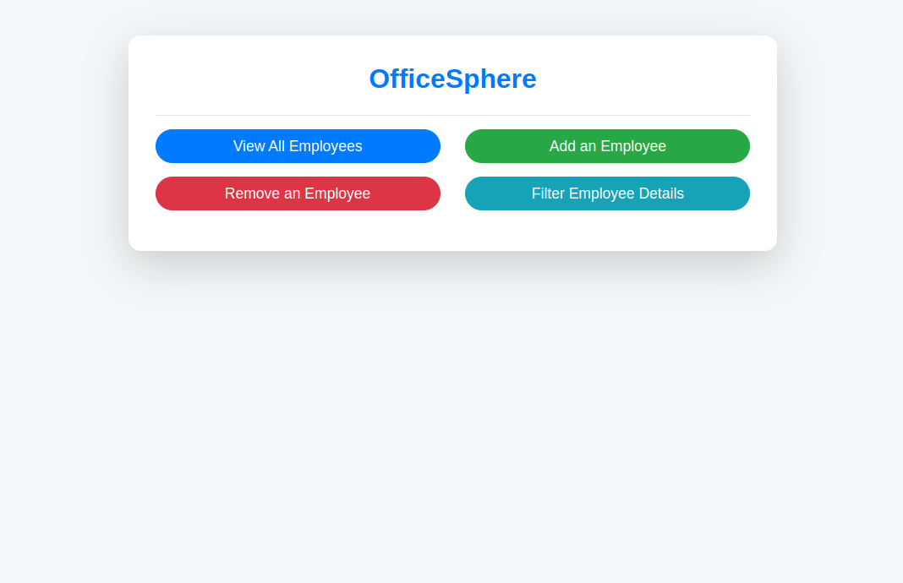
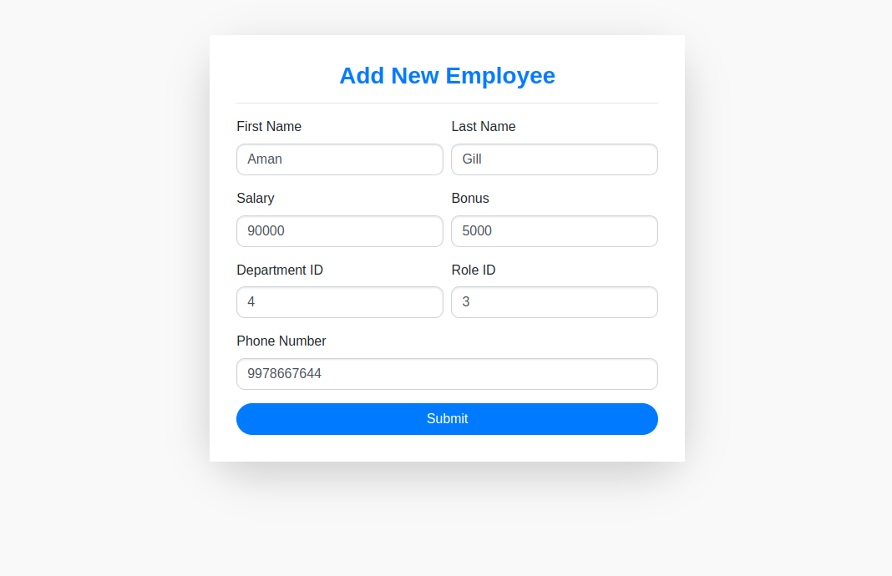
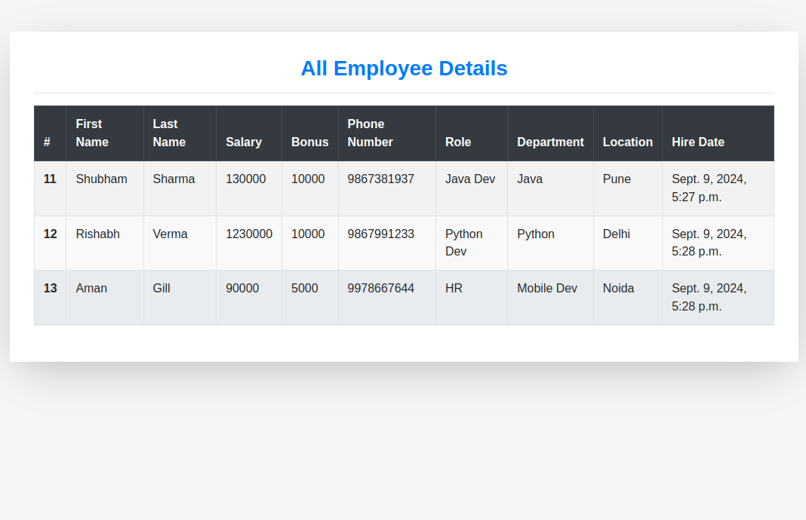
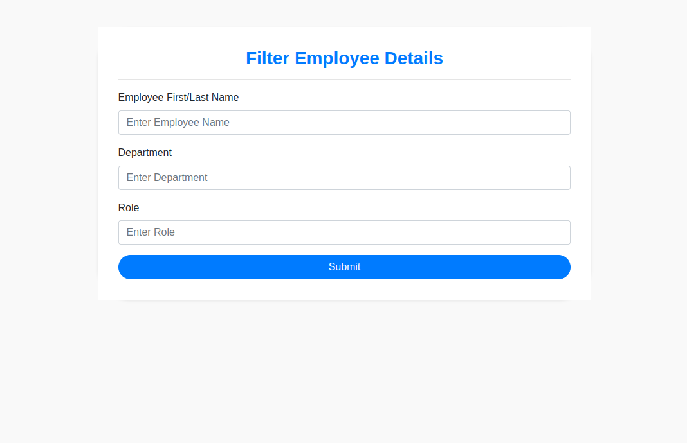
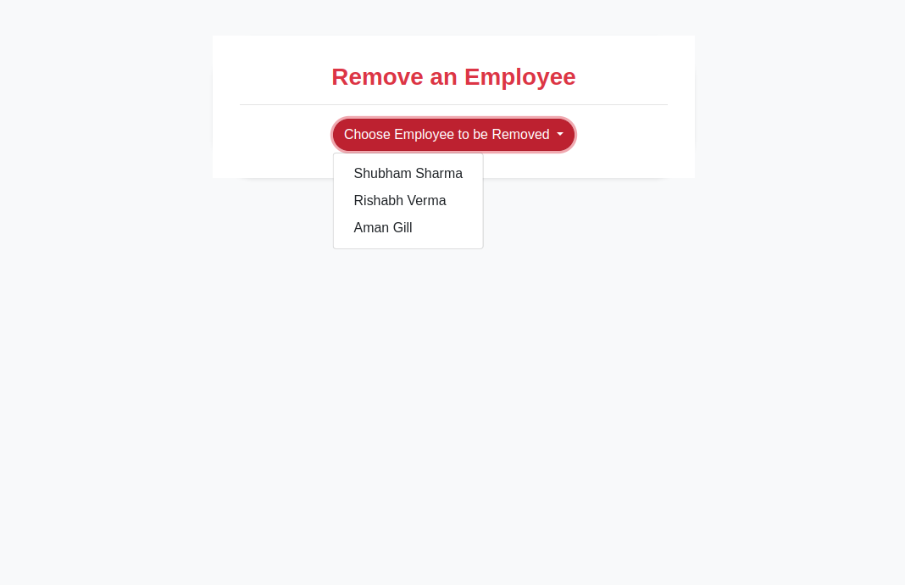

# OfficeSphere - Employee Management System

**OfficeSphere** is a web-based Employee Management System built using Django. It enables organizations to efficiently manage employee records with easy CRUD (Create, Read, Update, Delete) operations. This role-based system allows administrators to manage employees and their data seamlessly.

## Features

- **Add Employee**: Admins can add new employees with all necessary details.
- **View Employee Details**: Admins can access a list of all employee information.
- **Update Employee Details**: Admins can modify employee details when required.
- **Delete Employee**: Admins can remove employees from the system.

## Technologies Used

- Python
- Django
- HTML/CSS
- Bootstrap

## Installation

To set up OfficeSphere, ensure you have Python v3.8+ and Django v4.0.4+ installed.

1. Clone the repository:

    ```bash
    git clone <repository_url>
    ```

2. Navigate to the project directory:

    ```bash
    cd OfficeSphere
    ```

3. Install the required dependencies:

    ```bash
    pip install -r requirements.txt
    ```

4. Run the Django server:

    ```bash
    python manage.py runserver
    ```

## Usage

After running the server, open your browser and navigate to `http://127.0.0.1:8000/` to access the application.

## Screenshot










