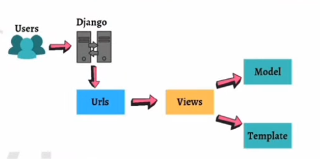

username: djangoproject
pwd: django1234

## steps to initiate a virtual environment
```
uv venv
source .venv/bin/activate
```
## steps to install Django
```
uv pip install Django
```
## steps to start a project
```
django-admin startproject projectname
cd projectname
```
## steps to run server
```
python manage.py runserver
```

## steps to create an app
```
python manage.py startapp appname
```


## models in django
```python
from django.db import models


class Person(models.Model):
    first_name = models.CharField(max_length=30)
    last_name = models.CharField(max_length=30)
```

# What Is The Command For Migrations In Django?

- Command to create a migration file inside the migration folder:
```python manage.py makemigrations```

- After creating a migration, to reflect changes in the database permanently execute migrate command:
```python manage.py migrate```

- To see raw SQL query executing behind applied migration execute the command:
```python manage.py sqlmigrate app_name migration_name```
```python manage.py sqlmigrate nitapp 0001```

- To see all migrations, execute the command:
```python manage.py showmigrations```

- To see app-specific migrations by specifying app-name, execute the command:
```python manage.py showmigrations nitapp```

## STEPS TO CREATE SUPERUSER IN DJANGO

- command to create a suepr user
```python manage.py createsuperuser```

- enter your desired username and press enter
```Username: admin```

- enter email address
```Email address: admin@abc.com```

- final step is to enter your password 
```password: ******```


## difference bw project and app in django

- project is the ENTIRE DJANGO APPLICATION
- app is a module inside the project that deals with one specific case

- for eg -- payment system (app) in eCommerce app (project)

- an app is basically a web application that is created to perform a specific task
- a project, on the other hand, is a collection of these apps

- therefore, a single project can consist of 'n' number of apps and a single app can be in multiple projects

### Explain How A Request Is Processed In Django?

- Here, a user requests for a resource to the Django, Django works as a controller and checks to the available resource in URL.
- When Django server is started, the `manage.py` file searches for `settings.py` file, which contains information of all the applications installed in the project, middleware used, database connections and path to the main URLs config.

`Manage.py >> Setting.py >> urls.py >> views.py >> models.py >> templates`



- Django first determines which root URLconf or URL configuration module is to be used.
- Then, that particular Python module `urls` is loaded and then Django looks for the variable `urlpatterns`.
- Then check each URL pattern in `urls.py` file, and it stops at the first match of the requested URL.
- Once that is done, the Django then imports and calls the given view.
- In case none of the URLs match the requested URL, Django invokes an error-handling view.
- If URL maps, a view is called that interacts with the model and template, it renders a template.
- Django responds back to the user and sends a template as a response.


## How To View All Items In The Model Using Django QuerySet?

**Django Command To View All Items In A Model:**

```python
Users.objects.all()
```

## What Is Context In Django?

- A context in Django is a dictionary, in which keys represent variable names and values represent their values. This dictionary (context) is passed to the template which then uses the variables to output the dynamic content.

- A context is a variable name -> variable value mapping that is passed to a template.

- Context processors let you specify a number of variables that get set in each context automatically – without you having to specify the variables in each `render()` call.


## How to Delete/Insert/Update An Object Using QuerySet In Django?

### QuerySet To Insert/Add An Object:

```python
new_user = User(name="Nitin Mangotra", city="Gurgaon")
new_user.save()
```


## Explain Q Objects in Django ORM?

**Q object** `django.db.models.Q` is an object to encapsulate a collection of keyword arguments specified as FIELD LOOKUPS.  
**Q objects** are used to write complex queries, as in filter() functions just "AND" the conditions, while if you want to "OR" the conditions you can use Q objects.

Let's see an example:

```python
from django.db import models
from django.db.models import Q

Models.objects.get( 
  Q(question__startswith='When') | 
  Q(answer__startswith='On') | 
  Q(answer__startswith='At') 
)
```

[Q Objects can be combined with the help of the | and & operators to get a new Q Object]

This is equivalent to the following SQL WHERE Clause:
```sql
SELECT * FROM Model WHERE question LIKE 'When%' 
  AND (answer='On%' OR answer='At%')
```